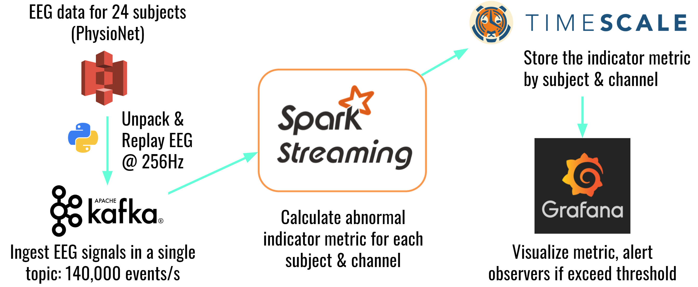

Real-time electroencephalography (EEG) signal analysis for monitoring seizure activity at scale

## Table of Contents

1. [About](#about)
2. [Engineering Design](#engineering-design)
3. [Deployment](#deployment)
4. [Credits](#credits)
5. [Reference](#references)

## Overview

An estimated 3.4 million Americans have epilepsy [1]. Despite its prevalence, accurate diagnosis of epilepsy is difficult: in fact, experts estimate that about 20% of people are misdiagnosed [2]. Electroencephalography (EEG) enables us to visualize brain activity and understand the nature of epileptic seizures, but they require extensive processing [3], and needs to be contextualized with a detailed and reliable account of the corresponding seizure event, which is often unavailable [4]. **_epileptiSentry_** leverages scalable stream processing technologies to:

1. identify potential seizure activities from EEG signals real-time; and
2. notify the right people to closely monitor the seizure events as they happen

## Engineering Design

### Processing Pipeline



A Python script unpacks EEG data in S3 (see the Data Source section), reproduces them as stand-ins for EEG instruments, and sends them to a cluster of EC2 instances running Kafka. A cluster with a matching number of EC2 instances running Spark consumes the messages and calculates the abnormal indicator metric for each subject and channel, which is stored in TimescaleDB. Grafana is used to visualize the metric and issue alerts to observers if a predefined threshold is exceeded.

### Processing Logic

The processing logic uses a discrete wavelet tranform-based method described by Ocak [5]. For a more in-depth discussion, consult the [README file in the Spark subdirectory](./src/spark/README.md).

### Data source

EEG data was sourced from [PhysioNet](https://physionet.org/pn6/chbmit/)'s [CHB-MIT Scalp EEG Database](https://physionet.org/pn6/chbmit/), mirrored in S3.
>This database, collected at the Children’s Hospital Boston, consists of EEG recordings from pediatric subjects with intractable seizures. Subjects were monitored for up to several days following withdrawal of anti-seizure medication in order to characterize their seizures and assess their candidacy for surgical intervention.

## Deployment

epileptiSentry was developed and deployed using [Amazon Web Services](https://aws.amazon.com/)' cloud computing platform.

### EC2 Configuration

Role | Signal Reproduction | Kafka | Spark | TimescaleDB | Grafana
---: | :---: | :---:| :---:| :---:| :---:
**Type** |  c5.xlarge | m5.large | c5.2xlarge | c5.2xlarge | t3.micro
**Number** | 2 | 5 | 5 | 1 | 1

### Signal Reproduction

Launch two c5.xlarge instances running Ubuntu 18.04 LTS with roles for S3 access. Install Python 3.7.3 and required packages:

```bash
python3.7 -m pip -r $PROJECT_HOME/config/eeg-player-requirements.txt
```

To start signal reproduction, run a bash script from each instance, which will simultaneously kick off 12 processes running *produce-signals.py*.

```bash
src/sig_gen/start_producer.sh  
```

To stop all processes from the above:

```bash
pkill -f produce-signals
```

### Kafka & Zookeeper

[Insight Pegasus](https://github.com/InsightDataScience/pegasus) is required to deploy this cluster. Once Pegasus is installed, run `deploy_kafka_cluster_pegasus.sh` in the `config/kafka-cluster` directory.

### Spark

[Download](https://spark.apache.org/downloads.html) and install Spark 2.4.3 pre-built with Apache Hadoop 2.7+ on instances running Ubuntu 18.04 LTS. Install Python 3.7.3 and Python packages:

```bash
python3.7 -m pip -r config/sparkcluster-requirements.txt
```

### TimescaleDB

Launch an c5.2xlarge instance with Amazon Machine Image (AMI) [provided by Timescale](https://docs.timescale.com/v1.3/getting-started/installation/ami/installation-ubuntu-ami). Then, import the following schema:

```bash
psql -U postgres -d epileptisentry -f config/tsdb-schema.sql
```

### Grafana

Follow the [instructions from the Grafana Labs website](https://grafana.com/docs/installation/debian/) to deploy Grafana. Custom configuration key-values and apache2's setup (http-to-https redirection) are available in the `config/grafana' directory.

## Credits

epileptiSentry was developed by David Lee ([LinkedIn Profile](https://www.linkedin.com/in/wdlee/)). This project was a deliverable from my fellowship in Insight Data Engineering Fellowship program in June 2019 in New York City, NY, United States.

## References

[1] U.S. Center for Disease Control and Prevention. [Epilepsy Data and Statistics](https://www.cdc.gov/epilepsy/data/index.html).  
[2] Oto, M. [The misdiagnosis of epilepsy: Appraising risks and managing uncertainty.](https://www.seizure-journal.com/article/S1059-1311(16)30297-7/fulltext) Seizure (2017) **44**:143-6.  
[3] Bigdely-Shamlo et al. [The PREP pipeline: standardized preprocessing for large-scale EEG analysis.](https://www.frontiersin.org/articles/10.3389/fninf.2015.00016/full) Front Neuroinform (2015) **9**:16.  
[4] Moeller et al. [Electroencephalography (EEG) in the diagnosis of seizures and epilepsy.](https://www.uptodate.com/contents/electroencephalography-eeg-in-the-diagnosis-of-seizures-and-epilepsy) UpToDate (2018).  
[5] Ocak, H. [Automatic detection of epileptic seizures in EEG using discrete wavelet transform and approximate entropy.](http://www.sciencedirect.com/science/article/pii/S0957417407006203) Exp System Appl (2009) **2**, Part 1:2027-2036.
